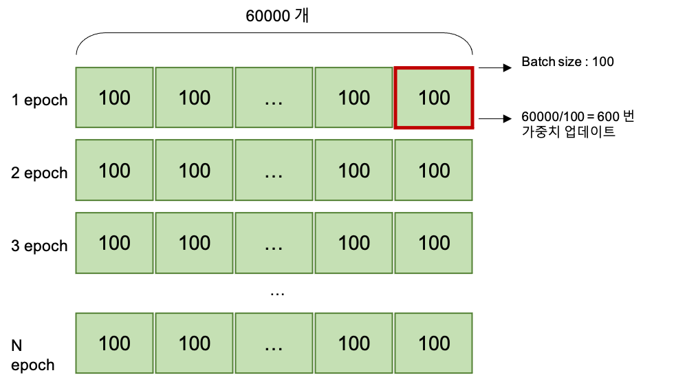

### Chapter 04 - 신경망 학습

---

이번 장에서는 학습의 지표인 **손실함수**와, 손실 함수의 값을 작게 만드는 기법으로 **함수의 기울기를 활용하는 경사법**을 소개한다.

- 딥러닝을 종단간 기계학습(end-to-end machine learning) 이라고도 한다.
- 신경망은 주어진 데이터를 온전히 학습하고, 주어진 문제의 패턴을 발견하려 시도한다.
- 기계학습 문제에서, training data/test data 로 나누어 학습/실험을 수행한다.


1. **손실함수(Loss function)**

   신경망 학습에서 사용하는 지표로, 일반적으로 평균제곱오차와 교차엔트로피오차를 사용한다.

   - 평균제곱오차(Mean Squared Error, MSE)
     $$
     E = \frac{1}{2}\sum_k(y_k-t_k)^2
     $$

     ```python
     def mean_squared_error(y, t):
     	return 0.5*np.sum((y-t)**2)
     ```

     

   - 교차 엔트로피 오차 (Cross Entropy Error, CEE)
     $$
     E = -\sum_kt_klog\,y_k
     $$

     ```python
     def cross_entropy_error(y, t):
     	delta = 1e-7
     	return -np.sum(t*np.log(y+delta))
     ```

     (delta 를 더하는 이유는 아주 작은 값을 더해서 함수의 값이 0이 되지 않도록, 즉 마이너스 무한대가 발생하지 않도록. )

   - 왜 손실함수를 설정하는가?

     - 신경망 학습에서는 최적의 매개변수(가중치, 편향)을 탐색할 때 손실 함수의 값을 가능한 한 작게 하는 매개변수 값을 찾는다.

     - 매개 변수의 미분을 계산하고, 그 미분 값을 단서로 매개변수의 값을 서서히 갱신한다.
     - 정확도를 지표로 삼는 것 대신 손실함수를 지표로 삼는 이유: 정확도는 매개변수의 미소한 변화에 거의 반응을 보이지 않고, 반응이 있더라도 그 값이 불연속적으로 갑자기 변한다. 마치 '계단함수' 처럼.

   - 손실함수의 변수는?

     - **데이터가 아니라, 가중치와 편향.**

2. **수치미분**

   미분계수 
   $$
   f'(x) = \lim_{h\to0}\frac{f(x+h) - f(x)}{h}
   $$
   이 책에서는 반올림 오차 문제를 해결하기 위해 충분히 작은 값 h = $10^-4$을 대입해 근사하도록 쓴다.

   그리고 오차를 줄이기 위한 또 다른 방법으로, 다음의 수식을 쓰기도 한다.
   $$
   f'(x) = \lim_{h\to0}\frac{f(x+h) - f(x-h)}{2h}
   $$
   
3. **기울기** 
   $$
   (\frac {\partial f}{\partial x_0}, \frac {\partial f}{\partial x_1})
   $$
   처럼 모든 변수의 편미분을 벡터로 정리한 것을 ***기울기***(gradient) 라고 한다.

   ```python
   def numerical_gradient(f, x):
   	h = 1e-4 #0.0001
   	grad = np.zeros_like(x) # x와 형상이 같은 배열을 생성
   	
   	for idx in range(x.size):
       tmp_val = x[idx]
       # f(x+h) 계산
       x[idx] = tmp_val + h
       fxh1 = f(x)
   
       # f(x-h) 계산
       x[idx] = tmp_val - h
       fxh2 = f(x)
   
       grad[idx] = (fxh1 - fxh2 / (2*h))
       x[idx] = tmp_val # 값 복원
   	
   	return grad
   ```

   > x = [a, b, c] 
   >
   > grad = [0, 0, 0] 
   >
   > h = 1e-4
   >
   > 1. idx == 0 일 때,
   >
   >    tmp_val = [a]
   >
   >    1) f(x+h) 계산,
   >
   >    x[0] = a + 1e-4  이고, x = [a + 1e-4, b, c]
   >
   >    fxh1 = f([a + 1e-4, b, c])
   >
   >    2) f(x-h) 계산,
   >
   >    x[0] = a - 1e-4 이고, x = [a - 1e-4, b, c]
   >
   >    fxh2 = f([a-1e-4, b, c])
   >
   >    grad[0] = {f([a + 1e-4, b, c]) - f([a-1e-4, b, c])} / 2*h
   >
   >    x[0] = a
   >
   >    grad  = [a 에 대한 편미분 값, b, c]

   기울기가 가리키는 쪽은 각 장소에서 함수의 출력 값을 가장 크게 줄이는 방향이다.

   

   - **신경망에서 기울기**
     $$
     W = \begin{pmatrix}w_{11} & w_{12} & w_{13} \\ w_{21} & w_{22} & w_{23} \end{pmatrix}
     \\
     가중치가 \; W\; 손실 함수가 \; L
     \\
     \frac{\eta L}{\eta W} = \begin{pmatrix}\frac{\eta L}{\eta W_{11}} & \frac{\eta L}{\eta W_{12}} & \frac{\eta L}{\eta W_{13}} \\ \frac{\eta L}{\eta W_{21}} & \frac{\eta L}{\eta W_{22}} & \frac{\eta L}{\eta W_{23}} \end{pmatrix}
     $$
     w를 조금 변경했을 때, 손실 함수 L 이 얼마나 변화하느냐.

     ```python
     ...
     def f(W):		# loss function
     	return net.loss(x,t)
     ...
     dW = numerical_gradient(f, net.W)		# W의 변화에 따른 Loss function f의 변화량
     print(dW)
     ```

     

   

4. **경사하강법(gradient descent)** 

   기울기를 잘 이용해 함수의 최솟값(또는 가능한 작은 값)을 찾으려는 경사법

   *주의할점* : 기울기가 가리키는 곳에 정말 함수의 최솟값이 있는지 보장할 수 없다.

   경사법을 수식으로 나타내면, 
   $$
   x_0 = x_0 - \eta{\frac {\partial f} {\partial x_0}}
   $$
   과 같이 나타낸다.

   - $\eta$ (에타) : 학습률(learning rate) 

   - 학습률 같은 매개변수를 하이퍼 파라미터라고 한다. (가중치와 편향 같은 신경망의 매개변수와는 다른 성질), 너무 크거나 너무 작으면 안된다. 

     ```python
     def gradient_descent(f, init_x, lr = 0.01, stem_num = 100):
     	x = init_x
     	
     	for i in range(step_num):
     		grad = numerical_gradient(f, x)
     		x -= lr*grad
     	return
     ```


##### 학습 알고리즘 구현하기

---

1단계 : 미니배치 (그 미니배치의 손실함수 값을 줄이는 것이 목표이다.)

2단계 : 기울기 산출 (미니배치의 손실함수를 줄이기 위해 각 가중치 매개변수의 기울기를 구한다. 기울기는 손실 함수의 값을 가장 작게 하는 방향을 제시함.)

3단계 : 매개변수 갱신 (가중치 매개변수를 기울기 방향으로 아주 조금 갱신)

4단계 : 1~3 반복

이 때, 데이터를 미니배치로 무작위로 선정하기 때문에 **확률적 경사 하강법 (stochastic gradient descent, SGD)** 라고 한다.

- 2층 신경망을 하나의 클래스로 구현 (ch04/two_layer_net.pys)

- 미니배치로 학습 구현 (ch04/train_neuralnet.py)

  

