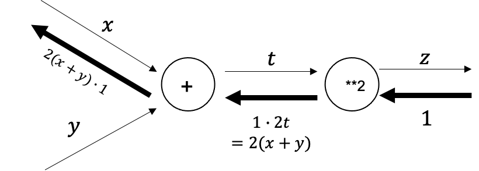
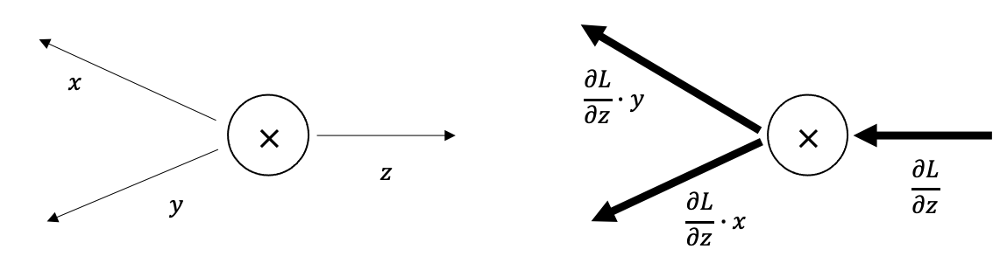

### Ch 05 - 오차역전파법

---

신경망의 가중치 매개변수의 기울기(= 가중치 매개변수에 대한 손실함수의 기울기) 를 **수치미분** 을 사용해 구했다.

수치미분은 단순하고 구현하기 쉽지만, 계산 시간이 오래걸린다.

이번 장에서는 가중치 매개변수의 기울기를 효율적으로 계산하는 **오차역전파법(backpropagation)** 을 배운다.

- 계산그래프를 통해 역전파를 통한 '미분'을 효율적으로 계산한다.

- **국소적 미분** 을 전달하는 원리는 **연쇄법칙** 에 따른다.

  

  - 얇은 선 : 순전파
  - 굵은 선 : 역전파
  - 계산 그래프를 통해서 z에 대한 x의 미분을 연쇄법칙을 통해 구할 수 있다.

  

#### 1. 덧셈 노드의 역전파

z = x+y 식의 미분은 **1** 이므로,

덧셈 노드의 역전파는 → **(상류에서 전해진 미분 * 1)**

즉, 입력된 값 그대로 다음 노드로 보내진다.

```python
class AddLayer :
	def __inint__(self):
		pass
	
	def forward(self, x, y):
		out = x + y
		return out
		
	def backward(self, dout):		# 상류에서 내려온 미분을 그대로 하류로 흘려보낸다.
		dx = dout * 1
		dy = dout * 1
		return dx, dy
```


#### 2. 곱셈 노드의 역전파

z = xy 에서 

​	x에 대한 미분 : y

​	y에 대한 미분 : x

따라서, 곱셈 노드의 역전파는 다음과 같다.



즉, **서로 바꾼 값** 을 곱해서 하류로 보낸다.

또한 곱셉 노드를 구현할 때는 *순전파의 입력 신호*를 변수에 저장해 둔다.

```python
class MulLayer :
	def __init__(self):
    self.x = None
    self.y = None
   
  def forward(self, x, y):
    self.x = x
    self.y = y
    out = x * y
    
  def backward(self, dout): # 상류에서 내려온 미분을 x와 y 를 바꿔 곱한다.
    dx = dout * self.y
    dy = dout * self.x
    
    return dx, dy
```


#### 3. 단순한 계층 구현하기 (덧셈, 곱셈)

코드 : ch05/buy_apple_orange.py


#### 4. 활성화 함수 계층 구현하기 (ReLU, Sigmoid)

- **ReLU**

  - ​	

  - 각 x 에 대해서 미분하면, 0보다 클 때는 **1**, 작거나 같을 때는 **0 **이다.

  - **따라서 역전파 때, 값이 0 보다 크면 값을 그대로, 0 이하면 하류로 신호를 보내지 않는다.**

  - 

    ```python
    class Relu:
      def __init__(self):
        self.mask = None
       
      def forward(self, x):	# 순전파
        self.mask = (x <= 0)	# 입력 값 x 에서 0보다 작은 값은 True, 반대는 False
        out = x.copy()
        out[self.mask] = 0		# True 인 원소는 0 이 된다. (= 0보다 작은 값은 0이 된다.)
        
       	return out
      
      def backward(self,dout): # 역전파
        dout[self.mask] = 0		# 상류에서 넘어온 미분에서, mask 의 원소가 True 인 곳은 0 으로 (= 0보다 작은 곳은 0 으로)
        dx = dout
        
        return dx
    ```

    

- **Sigmoid**

  - 

    

    

  이 식을 미분하면, 

  

  식이 다음과 같이 정리된다.

  

  **따라서 Sigmoid 계층의 역전파는 순전파에서 출력 y 만으로 계산할 수 있다.**

```python
class Sigmoid:
  def __init__(self):
    self.out = None
    
  def forward(self, x):		#순전파
    out = 1 / (1 + np.exp(-x))
    self.out = out		# 역전파 때 y 값을 사용하므로, out 에 보관
    
    return out
  
  def backward(self, dout):	#역전파
    dx = dout * (1.0 - self.out) * self.out  # 순전파 때 y 값을 사용하여 역전파 계산
    
    return dx
```


#### 5. Affine/Softmax 계층 구현하기

- **Affine 계층 **

  순전파 때 수행하는 행렬의 곱인 <u>Affine 변환</u>을 수행하는 계층

  역전파에서 행렬의 곱은 **전치행렬**(W_T)을 사용한다.

  

  **형상에 주의**

  ```python
  class Affine:
    def __init__(self, W, b):
      self.W = W
      self.b = b
      self.x = None
      self.dW = None
      self.db = None
      
    def forward(self, x):	# 순전파
      self.x = x
      out = np.dot(x, self.W) + self.b
      
      return out
    
    def backward(self, dout):	# 역전파
      dx = np.dot(dout, self.W.T)	# 위의 식과 동일하게 행렬의 곱 계산
      self.dW = np.dout(self.x.T, dout)
      self.db = np.sum(dout, axix = 0)
      
      return dx
  ```

* **Softmax-with-Loss** 계층

  정규화(소프트맥스 함수)와 손실 함수 (교차 엔트로피) 를 구현한 계층

  

  **<u>Softmax 계층의 출력과 정답 레이블의 차분</u>이 앞 계층에 전달 된다. -> 신경망 학습의 중요한 성질**


```python
class SoftmaxWithLoss:
  def __init__(self):
    self.loss = None #손실
    self.y = None  # Softmax 의 출력
    self.t = None  # 정답 레이블
    
  def forward(self, x, t): # 순전파
    self.t = t
    self.y = softmax(x)
    self.loss = cross_entropy(self.y, self.t)  # 예측 값과 정답 레이블의 손실함수 계산
    return self.loss
  
  def backward(self, dout = 1):	# 역전파
    batch_size = self.t.shape[0]
    dx = (self.y - self.t) / batch_size  # 역전파 때는 전파하는 값을 배치의 수(batch_size)로 나눠서 데이터 1개당 오차를 앞 계층으로 전파한다.
    
    return dx
```

